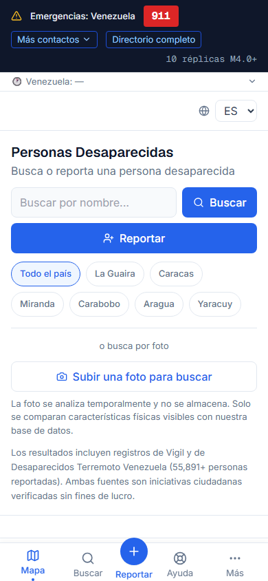
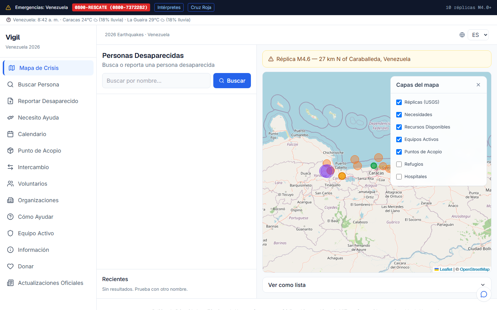
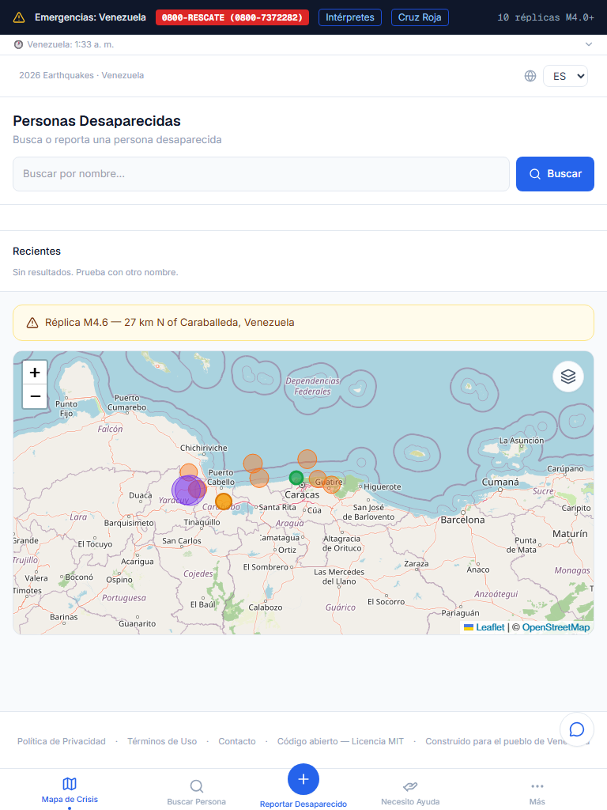
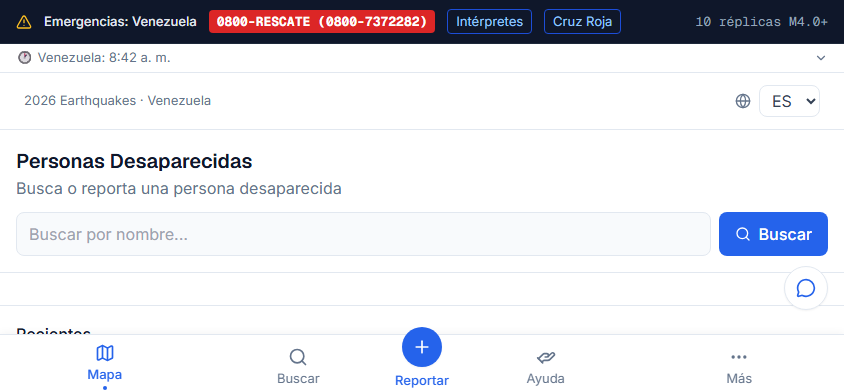

<div align="center">

<p align="center">
  
</p>

# Vigil

### We stand watch when it matters most.

A unified, open-source humanitarian crisis platform — real-time missing persons, crisis mapping, resource exchange, and volunteer coordination in one accessible interface.

**Live deployment:** Venezuela 2026 Earthquake Response · June 24, 2026 onward

<br />

[](https://vigil.youthewave.org)
[](./LICENSE)

<br />


<br />

[](https://tailwindcss.com)
[](https://leafletjs.com)
[](https://vercel.com)

<br />

**[vigil.youthewave.org](https://vigil.youthewave.org)** &nbsp;·&nbsp; **[github.com/Atenaxproject/vigil](https://github.com/Atenaxproject/vigil)**

</div>

---

## Why Vigil

Most crisis tools already exist — they're just scattered. Vigil does **not** reinvent them. It aggregates proven humanitarian platforms (USGS, ReliefWeb, OCHA, HDX, Google Person Finder) into a single calm interface, then adds the missing connective tissue: a live missing-persons board, a community resource exchange, and skills-based volunteer matching.

One config file change redeploys the whole platform for **any country, any disaster**.

### Built for six user groups

| Group | What they do on Vigil |
|---|---|
| 🆘 **Rescue teams** | Crisis map, active rescue zones, field presence check-in, locate needs |
| 🤝 **Volunteers** | Register skills, browse the marketplace, get matched with organizations |
| 🧍 **Victims** | Report needs, drop a help pin, find shelter and resources |
| 🌎 **Diaspora** | Search for missing family on a real-time board with public notes |
| 💛 **Donors** | Reach verified organizations with direct donation links |
| 🏢 **Organizations** | List services, receive volunteers, coordinate response |

---

## Screenshots

Production captures from [vigil.youthewave.org](https://vigil.youthewave.org). Refresh with `node scripts/visual-check.mjs`.

| iPhone portrait | Desktop (sidebar + map layers) |
|---|---|
|  |  |

| iPad portrait | iPhone landscape |
|---|---|
|  |  |

---

## What's live now

Verified against source and production as of **2026-06-30**. Optional integrations degrade gracefully when API keys are missing — they never crash the app.

### Core crisis tools

| Feature | Route | Notes |
|---|---|---|
| **Missing persons board** | `/buscar`, `/reportar` | Realtime feed on home; estado/municipio/parroquia on report form; state filter chips on search |
| **Photo search (AI vision)** | `/buscar` | Claude Vision describes traits, matches public records — no biometric storage; needs `ANTHROPIC_API_KEY` |
| **Claude AI assistant** | all pages (widget) | Live-data Q&A in 8 languages; streams from `/api/assistant`; degrades gracefully without API key |
| **Statistics by state** | `/estadisticas` | Real-time missing/found-alive counts per estado |
| **Person detail + public notes** | `/buscar/[id]` | Sightings thread; privacy-preserving contact flow |
| **PFIF export** | `/api/pfif` | [Google Person Finder](https://github.com/google/personfinder) XML interoperability |
| **Claim-token inbox** | `/mi-reporte/[token]`, `/mi-intercambio/[token]` | Passwordless management; claim URL on submit |
| **Crisis map** | `/` | USGS aftershocks, needs, resources, shelters, hospitals, collection points, active rescue teams |
| **Retractable map layers** | `/` (desktop) | Collapsible panel on `lg+`; preference in `localStorage` |
| **Collection points** | `/punto-de-acopio` | Citizen registration → amber map markers |
| **Resource exchange** | `/intercambio` | Offer or request goods, shelter, transport, skills, equipment |
| **Volunteer marketplace** | `/voluntarios` | Skills registration and directory |
| **I need help** | `/necesito-ayuda` | Drop a need pin on the map |

### Information & coordination

| Feature | Route | Notes |
|---|---|---|
| **Live information hub** | `/informacion` | USGS significant quakes, ReliefWeb, manual stats, infrastructure status |
| **Official updates** | `/noticias` | ReliefWeb feed (no API key) |
| **Events calendar** | `/calendario` | Category filters, Venezuela timezone labels |
| **Rescuer field presence** | `/equipo-activo` | Check-in, SOS, 4-hour auto-expire, map layer |
| **How to help** | `/como-ayudar` | 18 verified donation orgs from production seed |
| **Partner links** | `/organizaciones` | Curated NGOs from `crisis.config.ts` |
| **Weather & time bar** | all pages | Open-Meteo below emergency banner (no API key) |

### Trust, access & resilience

- 🚨 **Emergency banner** — Always-visible hotline (0800-RESCATE), Intérpretes, Cruz Roja. Government-operated intake tools intentionally excluded.
- 📬 **Official contact** — `vigil@youthewave.org` and `vigil.support@youthewave.org` via Cloudflare Email Routing.
- 💬 **Feedback widget** — Floating support button on all pages; admin review at `/admin/feedback`.
- 🔐 **Admin auth** — Supabase OTP + `VIGIL_ADMIN_EMAILS` allowlist.
- 🌐 **8 languages** — Spanish default; English, Portuguese, French, Italian, Chinese, German, Russian (machine-translated locales).
- 📱 **PWA / offline-first** — Service worker, `/offline` fallback, offline form queue, network-status banner.
- 📲 **PWA install UX** — iOS Safari dismissible install banner; Android/Chrome native install via Más menu.
- ⚖️ **Legal pages** — Privacy Policy and Terms in Spanish (`/privacidad`, `/terminos`) and English (`/privacy`, `/terms`).

### Desktop UX & accessibility

- **Collapsible sidebar** — `lg+` toggles between **280px** (icon + label) and **64px** (icon-only); preference in `localStorage`.
- **Skip-to-content link** — First focusable element; targets `#main-content`.
- **WCAG AA type scale** — 16px body floor, contrast-safe muted tokens.
- **Map accessible list** — Collapsible “Ver como lista” text alternative for map markers.
- **Keyboard map controls** — Custom zoom +/- with `aria-label`; Leaflet default zoom disabled.
- **Focus-visible rings** — Global outline audit across nav, forms, and icon buttons.

### Security & data protection

Privacy is architecture, not an afterthought:

- **Contact information is never displayed publicly.** All contact routes through Vigil's internal request flow.
- **RLS hardening (migration 006)** — Dropped `public_read_missing` on `missing_persons`; public reads use `public_missing_persons` view only. Anon-key direct contact queries return empty.
- **Rate limiting** — Per-IP limits on API routes via edge middleware.
- **Coordinate bounds validation** — Submissions outside crisis map bounds rejected.
- **IP hashing** — Stored as salted SHA-256 only; never in clear text.
- **Server key isolation** — `SUPABASE_SERVICE_ROLE_KEY` and `ANTHROPIC_API_KEY` in server-only modules; zero matches in client bundles.
- **Government exclusion** — Venezuelan government data sharing explicitly prohibited; VenApp not linked.

See the [Privacy Policy](https://vigil.youthewave.org/privacidad) and [Terms](https://vigil.youthewave.org/terminos).

---

## Coming soon

| Feature | Status |
|---|---|
| **Push notifications** | Planned — PWA permission flow for M4.0+ aftershocks |
| **WhatsApp / Telegram intake** | Architecture documented; no webhook handlers yet |
| **Full organization directory UI** | Schema + seed exist; `/organizaciones` shows partner links only |
| **Admin moderation dashboard** | Auth works; use Supabase Studio for queue today |
| **HDX dataset feed** | `src/lib/hdx.ts` exists; not surfaced on any page |
| **Resend outbound email** | Code in `src/lib/email/`; needs `RESEND_API_KEY` + `youthewave.org` verified in Resend |
| **AI duplicate cron (production)** | Code + Vercel schedule live; needs `ANTHROPIC_API_KEY` + `CRON_SECRET` + migration `008` applied |

---

## Documentation

| Resource | Description |
|---|---|
| [`docs/README.md`](./docs/README.md) | Documentation index |
| [`docs/architecture/CLAUDE.md`](./docs/architecture/CLAUDE.md) | Tech stack, constraints, agent instructions |
| [`docs/architecture/DESIGN-SYSTEM.md`](./docs/architecture/DESIGN-SYSTEM.md) | UI tokens, typography, component rules |
| [`docs/architecture/DEPLOYMENT.md`](./docs/architecture/DEPLOYMENT.md) | Supabase, Vercel, DNS, Resend, local dev |
| [`docs/build-process/`](./docs/build-process/) | Sequential build prompts (historical record) |

---

## Tech stack

| Layer | Choice | Notes |
|---|---|---|
| Framework | **Next.js 14** (App Router) | SSR, edge middleware, PWA-ready |
| Language | **TypeScript** (strict) | End-to-end types in `src/types` |
| Database | **Supabase** (Postgres + Realtime) | Row-level security, live subscriptions |
| Auth | **Supabase Auth** | Email/phone OTP, admin allowlist |
| Map | **Leaflet + OpenStreetMap** | Free, Venezuela-locked bounds |
| Styling | **Tailwind CSS** | Tokens from [`DESIGN-SYSTEM.md`](./docs/architecture/DESIGN-SYSTEM.md) |
| i18n | **next-intl** | 8 locales, Spanish-first |
| AI | **Claude (Haiku + Sonnet)** | Assistant Q&A, photo vision search, dedup cron (optional `ANTHROPIC_API_KEY`) |
| Email | **Resend** | Feedback alerts (optional) |
| Hosting | **Vercel** + **Cloudflare** | Edge network, DDoS protection, email routing |

---

## Quick start

```bash
# 1. Install
npm install

# 2. Configure environment
cp .env.example .env.local   # then fill in your keys (see below)

# 3. Run
npm run dev                  # http://localhost:3000
```

The app runs **without** a configured Supabase instance: static pages render, the USGS crisis map loads, and live-data sections show a calm empty state instead of crashing.

### Environment variables

```env
NEXT_PUBLIC_SUPABASE_URL=https://YOUR_PROJECT_REF.supabase.co
NEXT_PUBLIC_SUPABASE_ANON_KEY=your_anon_key
SUPABASE_SERVICE_ROLE_KEY=your_service_role_key   # server-only, never exposed
ANTHROPIC_API_KEY=your_anthropic_key              # optional, for AI assistant, photo search, dedup cron
CRON_SECRET=generate_a_strong_random_secret       # optional, secures /api/cron/dedup on Vercel
RESEND_API_KEY=your_resend_key                    # optional, feedback email alerts
VIGIL_ADMIN_SECRET=generate_a_strong_random_secret
VIGIL_ADMIN_EMAILS=orlando@atenaxproject.com
```

> Never commit `.env.local`. See [`DEPLOYMENT.md`](./docs/architecture/DEPLOYMENT.md) for migrations and DNS.

---

## Deploy your own crisis instance

Vigil is a **template**. To deploy for a different country or disaster, change one file:

```
src/config/crisis.config.ts
```

Update country bounds, emergency hotline, partner links, languages, and seismic query — then redeploy. Full guide in [`DEPLOYMENT.md`](./docs/architecture/DEPLOYMENT.md).

---

## Built by

Made with hope and love for Venezuela 🇻🇪

[Orlando Toro](https://atenaxproject.com) — Founder, Bbluestudios LLC  
For the people of Venezuela. For anyone who needs it next.

---

## Contributors & acknowledgments

| Role | Who |
|---|---|
| **Human** | [Orlando Toro](https://github.com/Orlando7oro) — Founder, architect, operator |
| **AI co-architect** | Claude (Anthropic) — Strategic co-design, system architecture, database schema, data protection, i18n, design system, legal documents |
| **AI build agent** | Cursor Agent — Code generation and file implementation |

**Humanitarian tech partners (methodology):** [Ushahidi](https://ushahidi.com) · [Google Person Finder](https://google.org/personfinder) · [Los Topos](https://www.lostopos.org) · [OCHA](https://www.unocha.org)

**Real-time data sources:** [USGS](https://earthquake.usgs.gov) · [ReliefWeb](https://reliefweb.int) · [HDX](https://data.humdata.org)

**For Venezuela. For whoever needs it next.**

---

## License

**MIT License** — Free to use, modify, and deploy for humanitarian purposes. Commercial use of the data is prohibited. See [Terms](https://vigil.youthewave.org/terminos).
