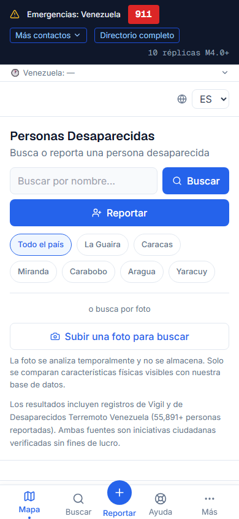
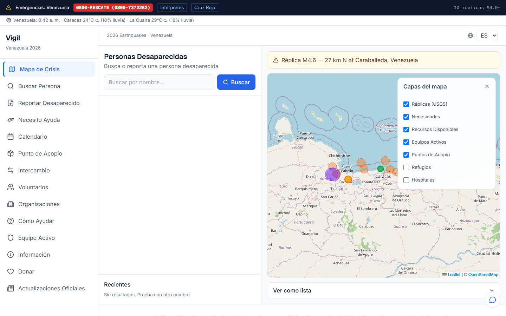
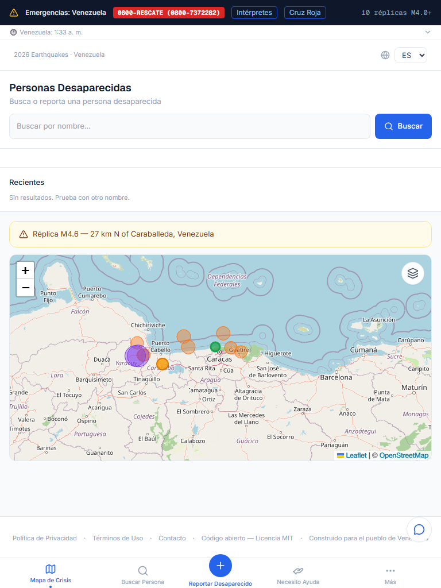
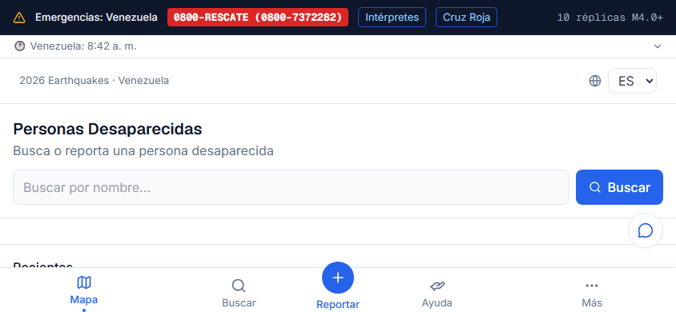

<div align="center">

<p align="center">
  
</p>

# Vigil™

### We stand watch when it matters most.

An open-source humanitarian crisis PWA — federated missing-persons search, crisis mapping, resource exchange, and volunteer coordination in one calm, Spanish-first interface. The code is open under Apache-2.0; the Vigil™ and YouTheWave™ names and brand are protected trademarks (see TRADEMARK.md).

**Live:** Venezuela 2026 Earthquake Response · [vigil.youthewave.org](https://vigil.youthewave.org) · June 24, 2026 onward  
**Operator brand:** [YouTheWave](https://youthewave.org) ([youthewave.org](https://youthewave.org) is live) · Formal Launching with Improvements phase **closed** (2026-07-26)

**What Vigil is not:** an emergency dispatcher, a donations processor, a government intake tool, or a biometric identification system.

<br />

[](https://vigil.youthewave.org)
[](./LICENSE)

<br />


<br />

[](https://tailwindcss.com)
[](https://leafletjs.com)
[](https://vercel.com)

<br />

**[vigil.youthewave.org](https://vigil.youthewave.org)** &nbsp;·&nbsp; **[youthewave.org](https://youthewave.org)** &nbsp;·&nbsp; **[vigil.youthewave.com](https://vigil.youthewave.com)** (redirects) &nbsp;·&nbsp; **[github.com/Atenaxproject/vigil](https://github.com/Atenaxproject/vigil)**

</div>

---

## Why Vigil

Most crisis tools already exist — they're just scattered. Vigil does **not** reinvent them. It aggregates proven humanitarian platforms (USGS, ReliefWeb, OCHA, HDX, Google Person Finder) into a single calm interface, then adds the missing connective tissue: a live missing-persons board, a community resource exchange, and skills-based volunteer matching.

One config file change redeploys the whole platform for **any country, any disaster**.

### Built for six user groups

| Group | What they do on Vigil |
|---|---|
| 🆘 **Rescue teams** | Crisis map, active rescue zones, field presence check-in, locate needs |
| 🤝 **Volunteers** | Register skills, browse the marketplace, get matched with organizations |
| 🧍 **Victims** | Report needs, drop a help pin, find shelter and resources |
| 🌎 **Diaspora** | Search for missing family on a real-time board with public notes |
| 💛 **Donors** | Reach verified organizations with direct donation links |
| 🏢 **Organizations** | List services, receive volunteers, coordinate response |

---

## What Vigil Does

### Missing persons search — federated with Desaparecidos Terremoto Venezuela

- Search Vigil's own database AND Desaparecidos Terremoto Venezuela simultaneously
- Results from both platforms shown side by side with clear source attribution
- Photo-based search: upload a photo; Claude Vision produces a *text description* of visible features for matching — Vigil stores no biometric templates
- Geographic filters: estado, municipio, parroquia across all 24 Venezuelan states
- Zero-result recovery: a careful three-action state (widen the search, create a report, check sister platforms) instead of a dead end — never a rendered "0"
- DTV referral awareness: visitors arriving from Desaparecidos Terremoto Venezuela get a contextual orientation, detected client-side only and never persisted or logged
- PFIF 1.4 compatible — interoperable with Google Person Finder
- Real-time updates across all open browser tabs (Supabase Realtime)

### Crisis map — live data from multiple verified sources

- USGS aftershock data (real-time, 5-min refresh, magnitude 2.0+, **source-labeled USGS/FUNVISIS** when FUNVISIS feed available)
- GDACS disaster alerts (United Nations / European Commission)
- Centers and hospitals from Desaparecidos Terremoto Venezuela (integrated)
- Citizen-reported needs, resources, shelters, danger zones, rescue zones
- Rescuer safety presence system with GPS check-in and SOS button
- Layer toggles for all marker types

### AI coordination — Claude-powered in 8 languages

- Live Q&A assistant: answers questions using real database data, never invents
- Natural language intake: describe a person in plain text, Claude structures it
- Photo-assisted search via vision text descriptions (no Vigil-side biometrics)
- Hourly duplicate detection (Claude Haiku cron)

---

## Screenshots

Production captures from [vigil.youthewave.org](https://vigil.youthewave.org). Refresh with `node scripts/visual-check.mjs`.

| iPhone portrait | Desktop (sidebar + map layers) |
|---|---|
|  |  |

| iPad portrait | iPhone landscape |
|---|---|
|  |  |

---

## What's live now

Verified against source and production as of **2026-07-27** (after next-round ship [#32](https://github.com/Atenaxproject/vigil/pull/32)). Optional integrations degrade when credentials are unset — they never crash the app.

### Core crisis tools

| Feature | Route | Notes |
|---|---|---|
| **Missing persons board** | `/buscar`, `/reportar` | Realtime feed on home; estado/municipio/parroquia on report form; state filter chips on search; client image compression on photo upload |
| **Photo search (AI vision)** | `/buscar` | Claude Vision describes traits as text, matches public records — no biometric storage; client image compression before upload; needs `ANTHROPIC_API_KEY` |
| **Claude AI assistant** | all pages (widget) | Live-data Q&A in 8 languages; streams from `/api/assistant`; degrades gracefully without API key |
| **Statistics by state** | `/estadisticas` | Vigil's own missing/found-alive counts per estado (Supabase Realtime); federated DTV figures shown only when a complete enumeration is available, suppressed otherwise |
| **Contested figures** | `/estadisticas` | Official casualty figures published with issuer attribution and independent counterpoints (Provea, USGS PAGER, UN, academic) stacked beneath — never averaged into one number |
| **Person detail + public notes** | `/buscar/[id]` | Sightings thread; privacy-preserving contact flow |
| **PFIF export** | `/api/pfif` | [Google Person Finder](https://github.com/google/personfinder) XML interoperability |
| **Claim-token inbox** | `/mi-reporte/[token]`, `/mi-intercambio/[token]` | Passwordless management; claim URL on submit |
| **Crisis map** | `/` | USGS aftershocks (source-labeled), needs, resources, shelters, hospitals, collection points, active rescue teams; region tabs → `/apoyo-usa` |
| **USA/Diaspora hub** | `/apoyo-usa` | South Florida tri-county map (separate bounds), collection points, diaspora orgs, intercambio/events filtered by `region_scope`; does not share Venezuela map data |
| **Connectivity / comms layer** | `/conectividad` | WiFi, Starlink, cell signal citizen reports — map layer + info card on `/informacion` |
| **Retractable map layers** | `/` (desktop) | Collapsible panel on `lg+`; preference in `localStorage` |
| **Collection points** | `/punto-de-acopio` | Citizen registration → amber map markers |
| **Resource exchange** | `/intercambio` | Offer or request goods, shelter, transport, skills, equipment |
| **Volunteer marketplace** | `/voluntarios` | Skills registration and directory (now includes structural_engineer, architect, surveyor for post-disaster property assessment). |
| **Property safety assessment** | `/evaluacion-estructural` | ATC-20-style green/yellow/red tagging; volunteer-assigned only (structural_engineer/architect/surveyor roles), never AI-assigned; client image compression on photo upload; claim link at `/mi-evaluacion/[token]` |
| **I need help** | `/necesito-ayuda` | Drop a need pin on the map |

### Information & coordination

| Feature | Route | Notes |
|---|---|---|
| **Live information hub** | `/informacion` | USGS significant quakes, GDACS alerts, manual stats, infrastructure status, emergency directory |
| **Press kit** | `/prensa` | Boilerplate, provenance fact sheet, downloadable ZIP (markdown + design-system PDFs) |
| **Operator hazard monitor** | `/monitor` | Global early-warning relay (USGS/GDACS/hazards) with DB-level kill switch; URL-reachable only, intentionally not in public nav pending FIRMS/GDACS redistribution confirmation |
| **Events calendar** | `/calendario` | Category filters, Venezuela timezone labels |
| **Rescuer field presence** | `/equipo-activo` | Check-in, SOS, 4-hour auto-expire, map layer |
| **How to help** | `/como-ayudar` | Curated, source-dated donation organizations; overseas-logistics honesty guidance |
| **Partner links** | `/organizaciones` | Verified NGO directory (admin-approved), sourced from the production `organizations` table |
| **Weather & time bar** | all pages | Open-Meteo below emergency banner (no API key) |

### Trust, access & resilience

- 🚨 **Emergency banner** — Always-visible **911** call button plus verified carrier access codes (Movistar 911 / \*1, Digitel 112 / \*112, Movilnet \*1 / \*911, Cantv 171) and a full emergency directory sheet. Government-operated intake tools intentionally excluded.
- 📬 **Official contact** — `vigil@youthewave.org`, `vigil.support@youthewave.org`, and `support@youthewave.org` via Cloudflare Email Routing.
- 💬 **Feedback widget** — Floating support button on all pages; admin review at `/admin/feedback`.
- 🔐 **Admin auth** — Supabase OTP + `VIGIL_ADMIN_EMAILS` allowlist.
- 🌐 **8 languages** — Spanish default; English, Portuguese, French, Italian, Chinese, German, Russian (machine-translated locales).
- 📱 **PWA / offline-first** — Service worker, `/offline` fallback, offline form queue, network-status banner.
- 📲 **PWA install UX** — iOS Safari dismissible install banner; Android/Chrome native install via Más menu.
- ⚖️ **Legal pages** — Privacy Policy and Terms in Spanish (`/privacidad`, `/terminos`) and English (`/privacy`, `/terms`).

### Desktop UX & accessibility

- **Global accessibility controls** — Header type-scale toggle (**A / A+ / A++**) and high-contrast mode, available from every page; preference persisted.
- **Collapsible sidebar** — `lg+` toggles between **280px** (icon + label) and **64px** (icon-only); preference in `localStorage`.
- **View-mode navigation** — Six audience modes filter the sidebar and mobile bar; the menu sheet always exposes the full site, labeled as such, with the active mode's group pinned first.
- **Skip-to-content link** — First focusable element; targets `#main-content`.
- **WCAG AA type scale** — 16px body floor, contrast-safe muted tokens.
- **Map accessible list** — Collapsible “Ver como lista” text alternative for map markers.
- **Keyboard map controls** — Custom zoom +/- with `aria-label`; Leaflet default zoom disabled.
- **Focus-visible rings** — Global outline audit across nav, forms, and icon buttons.

### Security & data protection

Privacy is architecture, not an afterthought:

- **Contact information is never displayed publicly.** Contact goes through Vigil’s request and claim-token flows.
- **Public listings use stripped database views** so contact and claim columns are not part of the public read surface.
- **Rate limiting** on submission and search API routes.
- **Coordinate bounds validation** — submissions outside the configured crisis map bounds are rejected.
- **IP hashing** — stored as salted hashes only; never clear text.
- **Server key isolation** — service-role and AI keys stay in server-only modules.
- **Government exclusion** — government intake tools are intentionally not linked.

See the [Privacy Policy](https://vigil.youthewave.org/privacidad) and [Terms](https://vigil.youthewave.org/terminos). Report sensitive security issues privately to `vigil@youthewave.org` — please do not file public exploit detail.

---

## Project Status — July 2026

**Phase:** Formal Launching with Improvements is **closed** (tag `phase/formal-launch-improvements-20260726`). Next-round app improvements **shipped** ([#32](https://github.com/Atenaxproject/vigil/pull/32); restore tag `restore/pre-next-round-improvements-20260727`). Venezuela production is live and in stable-ops care. Florida and México configs exist as **prebuilt / held** — activation waits on named local admins and `TODO-BEFORE-LAUNCH` gates (not an open feature sprint).

### ✅ Live now (Venezuela)

- **Federated missing persons search** — Vigil DB + a cached, short-lived DTV index queried in real time, accent-insensitive ranked name matching (no network-wide total is published — see [Data Partnership](#data-partnership))
- **Photo-based search** — Claude Vision text descriptions; no Vigil biometric storage
- **Client image compression** — wired on `/reportar`, property assessment, and photo search (same upload budget)
- **Claude AI assistant** — live database Q&A in 8 languages; does not invent figures
- **Crisis map** — USGS aftershocks (source-labeled), GDACS alerts, needs, resources, shelters, hospitals, rescue zones, collection points (including DTV-sourced centers); **USA diaspora hub** at `/apoyo-usa` (South Florida, separate `region_scope`)
- **Connectivity / comms layer** — WiFi, Starlink, cell signal points on map; citizen submission at `/conectividad`
- **Rescuer safety system** — GPS check-in, 4-hour auto-expiry, SOS button
- **Resource exchange (Intercambio)** — 7 categories, claim-token, 7-day auto-expiry
- **Volunteer registry** — skills-based, public directory (name privacy protected)
- **Organization directory** — verified NGOs from the production seed (including Hogar Bambi Venezuela child protection, GEM, and We Love Foundation), admin approval gate
- **Property safety assessment** — `/evaluacion-estructural`, ATC-20 green/yellow/red tagging, volunteer-assigned (structural_engineer/architect/surveyor), never AI-assigned, ToS §4 liability language
- **Events calendar** — donation drives, meetups, distributions, memorials
- **Citizen collection point registry** — self-registration, map display
- **Community wall (Muro)** — append-only, categorized, rate-limited
- **Real-time information hub** — USGS, GDACS, Venezuelan news RSS (ReliefWeb feed optional — see note under Optional integrations)
- **Infrastructure status tracker** — electricity, water, roads, airport (admin-editable)
- **Contested figures + provenance** — official casualty figures labeled with issuer and counterpoints (never averaged)
- **Moderation + public flags** — admin queue; community flag path for missing-person records
- **Feedback system** — floating widget, admin-only access
- **8-language interface** — ES/EN handcrafted, PT/FR/IT/ZH/DE/RU generated
- **PWA** — 2G-optimized, offline form queue, iOS/Android install support
- **Hourly duplicate detection** — Claude Haiku cron, flags to moderation queue
- **AI cost circuit breaker** — honest degrade/halt when spend proxies trip
- **Durable rate limits** — Upstash Redis when configured; in-memory fail-open otherwise
- **PFIF 1.4 endpoint** — `/api/pfif`, Google Person Finder compatible
- **Sister platform network** — 12 citizen platforms linked at `/red`
- **DTV active integration** — Desaparecidos Terremoto Venezuela federated API (live when `DTV_API_KEY` configured)
- **Social share images** — Open Graph + Twitter Card auto-generated
- **Geographic breakdown** — estado/municipio/parroquia across 24 Venezuelan states
- **Privacy** — contact info never public; public listings via stripped views; Venezuelan government intentionally excluded
- **YouTheWave** — operator brand site live at [youthewave.org](https://youthewave.org) (not “coming soon”)
- **License** — [Apache-2.0](./LICENSE) (code open; Vigil™/YouTheWave™ brand trademark-protected)

### 🔧 Optional integrations (code ready · credentials operator-owned)

Code paths are shipped and degrade cleanly when unset — **turning them on is operator work** (register keys / scenarios; never commit secrets). Core map and search stay usable either way. Env examples: [`.env.example`](./.env.example); setup notes: [`DEPLOYMENT.md`](./docs/architecture/DEPLOYMENT.md).

| Integration | Env / gate | Behavior when unset |
|-------------|------------|---------------------|
| **ReliefWeb** official updates (v2) | `RELIEFWEB_APPNAME` (approved OCHA appname) | No network call; Official Updates section suppressed on `/informacion` |
| **WhatsApp / Telegram** intake | `MAKE_WEBHOOK_SECRET` + Make.com scenario → `POST /api/make/webhook` | Route returns **503** (no open intake). `GET` reports `{ configured: false }` only |
| **Transactional email** | `RESEND_API_KEY` (+ optional `RESEND_FROM_EMAIL`); verify `youthewave.org` in Resend | Feedback / claim-link emails skipped; data still saved |
| **Additional crisis archetypes** | Config + docs | Scaffolding only — see [`CRISIS-ARCHETYPE-EXTENSION.md`](./docs/architecture/CRISIS-ARCHETYPE-EXTENSION.md). **No** FL/MX activation |

### Operator-gated / open backlog

Public, non-secret backlog — **not** a Florida/México product sprint:

- Finish **disaster-recovery proof** (encrypted dumps are running; restore dry-run still operator-owned — age private key)
- Resolve open **counsel / product** items before code: photo-display policy (prompt 78), `/monitor` nav visibility (redistribution rights), legal operator-line copy when incorporation lands
- Keep **multi-country activation** gated: Florida and México stay `prebuilt` until named admins + checklist gates — then DNS, feeds, locale, and privacy stance per country
- Optional product explorations: voice intake for low-literacy / field use; deeper PFIF exchange with partners **by agreement**; specialized Field / Family surfaces

---

## Sister Platforms

Vigil links honestly to every citizen-run platform responding to this crisis.
If you don't find someone here, check these too:

The 12 platforms below are the sister platforms carried in `crisis.config.ts` and shown on [`/red`](https://vigil.youthewave.org/red). Desaparecidos Terremoto Venezuela is the federated integration partner; the rest are honest outbound links.

| Platform | Focus |
|---|---|
| [Desaparecidos Terremoto Venezuela](https://desaparecidosterremotovenezuela.com) | Missing persons, facial recognition, geographic breakdown — **federated integration partner** |
| [Venezuela Te Busca](https://venezuelatebusca.com) | Missing persons search and resources |
| [CIVIS Venezuela](https://civisvenezuela.com) | Missing persons, damage maps, supply points, service status |
| [RedQuipu](https://redquipu.com) | Multi-organization coordination |
| [Mapa de Daños Venezuela](https://terremotovenezuela.com) | Structural damage mapping |
| [Mapa de Necesidades VZLA](https://mapadenecesidadesvzla.com/) | Zone-based live needs map (critical/partial/covered) |
| [Encuéntrame VZLA](https://encuentramevzla.com) | Hospital admissions locator (distinct from general missing-persons search) |
| [Venezuela Earthquake Map](https://venezuela-earthquake-map.vercel.app) | Crisis mapping |
| [Yummy SOS](https://sos.yummyrides.com) | Rides and logistics SOS |
| [Centros de Ayuda Venezuela](https://centrosayudavenezuela.org) | Diaspora collection points |
| [Ayuda Venezuela](https://ayudavenezuela.app) | Aid coordination |
| [Tiltely Venezuela](https://venezuela.tiltely.com) | Fundraising / donations |

---

## Documentation

| Resource | Description |
|---|---|
| [`docs/README.md`](./docs/README.md) | Documentation index |
| [`CONTRIBUTING.md`](./CONTRIBUTING.md) | How to contribute |
| [`CONTRIBUTORS.md`](./CONTRIBUTORS.md) | People and AI collaborators |
| [`docs/architecture/CLAUDE.md`](./docs/architecture/CLAUDE.md) | Tech stack, ethics constraints, agent contract |
| [`docs/architecture/DESIGN-SYSTEM.md`](./docs/architecture/DESIGN-SYSTEM.md) | UI tokens, typography, component rules |
| [`docs/architecture/DEPLOYMENT.md`](./docs/architecture/DEPLOYMENT.md) | Supabase, Vercel, DNS, local dev |
| [`docs/build-process/README.md`](./docs/build-process/README.md) | How we ship (short) |

---

## Tech stack

**Frontend:** Next.js 15 App Router · React 19 · Tailwind CSS · next-intl (8 languages) · PWA (@ducanh2912/next-pwa)

**Database:** Supabase (Postgres + Realtime + RLS) · PFIF 1.4 schema

**AI:** Claude Sonnet 4.6 (vision + photo search) · Claude Haiku 4.5 (assistant + dedup + property triage), all metered through a spend-aware circuit breaker

**Map:** Leaflet.js + OpenStreetMap · Supabase Realtime subscriptions

**Infrastructure:** Vercel · Cloudflare DNS · Supabase (sa-east-1 São Paulo)

**External data:** USGS Earthquake API · GDACS (UN) · ReliefWeb · Open-Meteo weather ·
Desaparecidos Terremoto Venezuela API (federated search + centers)

**Standard:** PFIF 1.4 — Google Person Finder compatible, enables data federation

---

## Data Partnership

Vigil federates with **[Desaparecidos Terremoto Venezuela](https://desaparecidosterremotovenezuela.com)**
as a registered integrator. Their records are searchable through Vigil alongside
Vigil's own, with full source attribution and a direct link back to their
platform.

**Vigil does not publish a total record count for the DTV network.** Their
public API exposes no count endpoint, so any total derived by paginating would
be a partial walk rather than a count — and publishing that as a network total
would misrepresent their data. Current figures live on their platform.

**Integration approach:** nothing is stored in Vigil's database. Because the DTV
API has no server-side search, Vigil keeps a short-lived in-memory name index
(30-minute TTL) and runs accent-insensitive ranked matching against it;
federated aggregate figures shown on `/estadisticas` are cached separately (~5
minutes) and suppressed entirely unless a complete enumeration is available.

**No biometrics on Vigil.** Photo search uses Claude Vision *text description*
of features. Partner platforms may offer their own identification tools on
their sites; Vigil does not store biometric templates and does not claim
facial-recognition capability.

This partnership is part of Vigil's commitment to building a network,
not competing with the other citizen platforms serving the same families.

---

## Quick start

```bash
# 1. Install
npm install

# 2. Configure environment
cp .env.example .env.local   # then fill in your keys (see below)

# 3. Run
npm run dev                  # http://localhost:3000
```

The app runs **without** a configured Supabase instance: static pages render, the USGS crisis map loads, and live-data sections show a calm empty state instead of crashing.

### Environment variables

```env
NEXT_PUBLIC_SUPABASE_URL=https://YOUR_PROJECT_REF.supabase.co
NEXT_PUBLIC_SUPABASE_ANON_KEY=your_anon_key
SUPABASE_SERVICE_ROLE_KEY=your_service_role_key   # server-only, never exposed
ANTHROPIC_API_KEY=your_anthropic_key              # optional, for AI assistant, photo search, dedup cron
CRON_SECRET=generate_a_strong_random_secret       # optional, secures /api/cron/dedup on Vercel
RESEND_API_KEY=your_resend_key                    # optional, feedback + claim-link emails
# RESEND_FROM_EMAIL=vigil@youthewave.org          # optional override (default: crisis.config contactEmail)
MAKE_WEBHOOK_SECRET=                              # optional, WhatsApp/Telegram via Make → /api/make/webhook
RELIEFWEB_APPNAME=                                # optional, approved OCHA v2 appname
VIGIL_ADMIN_SECRET=generate_a_strong_random_secret
VIGIL_ADMIN_EMAILS=vigil@youthewave.org
```

> Never commit `.env.local`. See [`DEPLOYMENT.md`](./docs/architecture/DEPLOYMENT.md) for migrations and DNS.

---

## Deploy your own crisis instance

Vigil is a **template**. To deploy for a different country or disaster, change one file:

```
src/config/crisis.config.ts
```

Update country bounds, emergency hotline, partner links, languages, and seismic query — then redeploy. Full guide in [`DEPLOYMENT.md`](./docs/architecture/DEPLOYMENT.md).

---

## Built by

**[Orlando Toro](https://github.com/Orlando7oro)** — Founder & Director (Bbluestudios LLC). Product judgment, crisis operations, and final say on scope and ethics.

Built with **AI engineering collaborators** under that direction — see [`CONTRIBUTORS.md`](./CONTRIBUTORS.md) for accurate roles (Architect-Orchestrator via Cursor; Claude for design/reasoning assistance). Agents execute against specs; they do not replace human accountability for privacy or go-live decisions.

For Venezuela. For whoever needs it next.

**Methodology inspiration:** [Ushahidi](https://ushahidi.com) · [Google Person Finder](https://google.org/personfinder) · [Los Topos](https://www.lostopos.org) · [OCHA](https://www.unocha.org)

**Public data feeds:** [USGS](https://earthquake.usgs.gov) · [ReliefWeb](https://reliefweb.int) · [HDX](https://data.humdata.org)

---

## License

**Code: [Apache License 2.0](./LICENSE).** You may use, modify, fork, and deploy Vigil for any purpose, including commercially. Apache-2.0 includes a patent grant and does **not** grant rights to the Vigil™ / YouTheWave™ names, logos, or brand — see [TRADEMARK.md](./TRADEMARK.md). Forks must rebrand.

**Data: not covered by the code license.** Records submitted to a Vigil deployment by the people it serves are governed by that deployment's Terms of Service and Privacy Policy. Nothing in the code license grants rights to personal data held in any Vigil instance. Scraping and commercial use of platform data are prohibited under the [Terms](https://vigil.youthewave.org/terminos).

**Federated data** from partner platforms remains theirs. Attribution and usage terms follow the originating platform.

> Code is Apache-2.0; brand is trademark-protected (TRADEMARK.md); data is governed by the Terms. Relicensing history: the repo standardized on Apache-2.0 on 2026-07-27.
