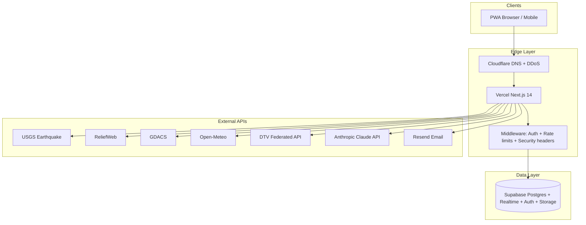
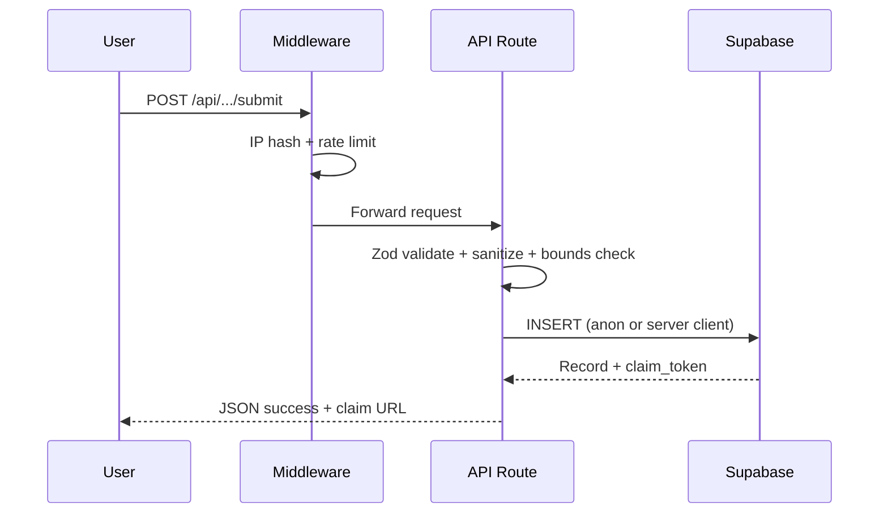

# Vigil — Complete Operational Guide

**Version:** Derived from codebase as of 2026-07-04  
**Live URL:** https://vigil.youthewave.org  
**Operator:** Orlando Toro / Bbluestudios LLC  
**Repository:** https://github.com/Atenaxproject/vigil

This is the master reference for help content, SOPs, onboarding, and internal operations.
Living specs remain in `docs/architecture/`; this guide reflects the **actual codebase** as source of truth.

---

## Document map

| Document | Contents |
|----------|----------|
| [onboarding.md](./onboarding.md) | End-user, volunteer, admin, and developer onboarding |
| [api-reference.md](./api-reference.md) | All 33 API routes — inputs, outputs, auth, rate limits |
| [data-model.md](./data-model.md) | Schema, views, RLS, relationships, migrations |
| [sops.md](./sops.md) | Daily ops, moderation, troubleshooting |
| [help-center-structure.md](./help-center-structure.md) | In-app help / FAQ outline |
| [glossary.md](./glossary.md) | Crisis and platform terminology |

---

## Table of contents

1. [Executive summary](#1-executive-summary)
2. [Audience & user groups](#2-audience--user-groups)
3. [Architecture overview](#3-architecture-overview)
4. [Tech stack & infrastructure](#4-tech-stack--infrastructure)
5. [Crisis configuration](#5-crisis-configuration)
6. [Routes & user flows](#6-routes--user-flows)
7. [Feature inventory](#7-feature-inventory)
8. [Authentication & authorization](#8-authentication--authorization)
9. [Integrations & background jobs](#9-integrations--background-jobs)
10. [Environment variables](#10-environment-variables)
11. [Error handling & security patterns](#11-error-handling--security-patterns)
12. [Testing & QA](#12-testing--qa)
13. [CI/CD & deployment](#13-cicd--deployment)
14. [Gaps & open items](#14-gaps--open-items)

---

## 1. Executive summary

**Vigil** is an open-source humanitarian crisis platform. Tagline: *We stand watch when it matters most.*

It does **not** replace existing crisis tools — it **aggregates** them (USGS, ReliefWeb, GDACS, HDX, Google Person Finder / PFIF, sister citizen platforms) into one mobile-first PWA interface.

**Current deployment:** Venezuela 2026 earthquake response (crisis date 2026-06-24).

**Design principle:** One file — `src/config/crisis.config.ts` — controls country, bounds, hotlines, partner links, languages, and legal metadata. Redeploy for any future crisis.

**Privacy architecture:** Contact information (phone, WhatsApp, email, exact GPS for missing persons) is **never** shown publicly. Contact flows through internal request systems and claim-token inboxes.

---

## 2. Audience & user groups

| Group | Primary needs | Key Vigil surfaces |
|-------|---------------|-------------------|
| Rescue teams | Map, needs, rescuer check-in, connectivity | `/`, `/equipo-activo`, `/conectividad` |
| Volunteers | Skills registration, property assessment | `/voluntarios`, `/evaluacion-estructural` |
| Victims | Report needs, get help | `/necesito-ayuda`, `/reportar` |
| Diaspora / family | Search missing persons, notes | `/buscar`, `/buscar/[id]` |
| Donors | Verified org links | `/donaciones`, `/como-ayudar` |
| Organizations | Directory, resource exchange | `/organizaciones`, `/intercambio` |
| Admin (Orlando) | Moderation, property queue, feedback | `/admin`, Supabase Studio, `/admin/feedback` |

---

## 3. Architecture overview

**Request flow (typical submission):**

---

## 4. Tech stack & infrastructure

| Layer | Technology | Notes |
|-------|------------|-------|
| Framework | Next.js 14.2 App Router | TypeScript strict |
| Styling | Tailwind CSS | Light mode only; WCAG AA |
| i18n | next-intl | 8 languages; ES default |
| Database | Supabase (Postgres) | Realtime on key tables |
| Auth | Supabase Auth | Email OTP; no passwords |
| Map | Leaflet + OpenStreetMap | Venezuela-bounded |
| PWA | @ducanh2912/next-pwa | Offline queue, `/offline` fallback |
| AI | Anthropic SDK | Haiku (assistant, dedup); Sonnet (vision) |
| Email | Resend | Optional outbound alerts |
| Hosting | Vercel | Auto-deploy on `main` |
| CDN | Cloudflare | CNAME to Vercel, proxied |
| Validation | Zod | All API inputs |

**Production Supabase project:** `macmlvybpxdnzfviimvl` (per `docs/architecture/DEPLOYMENT.md`).

**No CI/CD workflows** found in `.github/` — deployment is Vercel Git integration only.

---

## 5. Crisis configuration

**File:** `src/config/crisis.config.ts`

Key fields beyond the spec in `docs/architecture/CLAUDE.md`:

- `siteUrl`, `activeDeployment`
- `seismic` (replaces older `usgsQuery` naming)
- `dataRetention` (90-day active, 365-day archive — **pg_cron job is commented out in migration, not active**)
- `legal` (operator, emails, policy versions)
- 8 **sister-platform** entries in `partnerLinks` (DTV marked `integrated: true`)

**VenApp exclusion:** Intentional — no government-operated intake links (privacy / human-rights policy).

---

## 6. Routes & user flows

### Public pages (31 routes)

| Route | Purpose |
|-------|---------|
| `/` | Home: crisis map + missing persons feed |
| `/buscar` | Federated missing persons search (Vigil + DTV) |
| `/buscar/[id]` | Person detail + public notes + contact request |
| `/reportar` | Submit missing person report |
| `/mi-reporte/[token]` | Passwordless claim inbox (status, contact requests) |
| `/necesito-ayuda` | Drop need pin on map |
| `/intercambio` | Resource exchange board |
| `/mi-intercambio/[token]` | Manage exchange listing |
| `/voluntarios` | Volunteer registration + directory |
| `/organizaciones` | Verified NGO directory |
| `/donaciones` | Donation portal (links out) |
| `/como-ayudar` | Curated how-to-help (17 orgs) |
| `/noticias` | ReliefWeb official updates |
| `/informacion` | Live hub: USGS, GDACS, stats, infrastructure |
| `/estadisticas` | Missing/found counts by estado |
| `/calendario` | Community events |
| `/muro` | Community wall |
| `/red` | Sister platform network |
| `/punto-de-acopio` | Register collection points |
| `/conectividad` | WiFi / Starlink / cell signal reports |
| `/evaluacion-estructural` | Property safety assessment submission |
| `/mi-evaluacion/[token]` | Claim link for property assessment |
| `/equipo-activo` | Rescuer presence check-in + SOS |
| `/ayuda` | Help center (8 FAQ sections, accordion) |
| `/apoyo-usa` | USA diaspora coordination hub |
| `/privacidad`, `/terminos` | Legal (ES) |
| `/privacy`, `/terms` | Legal (EN) |
| `/offline` | PWA offline fallback |
| `/auth/login` | Admin OTP login |

### Admin routes

| Route | Auth mechanism |
|-------|----------------|
| `/admin` | Supabase OTP + `VIGIL_ADMIN_EMAILS` or `app_metadata.role=admin` |
| `/admin/feedback` | `VIGIL_ADMIN_SECRET` password gate (cookie via `/api/admin/verify`) |

---

## 7. Feature inventory

### Adaptive navigation (client-side)

- Six view modes + "Ver todo" — filters nav to 5–8 routes per persona
- First-visit mode picker (below emergency bar); `localStorage.vigil_view_mode`
- Header mode switcher; per-mode dismissible mini-guides → `/ayuda` anchors
- Does not affect `/admin`, `/auth/login`, or API/RLS

### Help center

- `/ayuda` — eight accordion sections from `help-center-structure.md` (Spanish primary)

### Sister network & external data

- `/red` — 14 sister platforms (link-only except DTV federation)
- DTV center sync — daily cron `/api/admin/sync-dtv-centers`
- CAV collection-point sync — weekly cron `/api/admin/sync-cav-centers` (`source=cav`, `verified=false`, `region_scope` by country)

### Missing persons

- Real-time board (Supabase Realtime on `missing_persons`)
- Federated search with DTV (55,891+ external records, not stored locally)
- Photo search: Claude Vision describes traits → match against Vigil DB + DTV facial ID
- Geographic filters: estado, municipio, parroquia (24 states via `src/lib/venezuela-geo.ts`)
- PFIF 1.4 export at `/api/pfif`
- Public notes (sightings) on detail pages
- Claim tokens for passwordless management
- Contact requests — submitter contact never public

### Crisis map (`/`)

- Layers: USGS aftershocks, needs, resources, shelters, hospitals, danger, rescue zones, collection points, DTV centers, property assessments, connectivity (comms), rescuer presence
- Retractable layer panel (desktop, `localStorage` preference)
- Accessible list alternative for map markers

### AI assistant

- Floating widget on all pages
- Streams from `/api/assistant` using live Supabase + USGS context
- Degrades gracefully without `ANTHROPIC_API_KEY`

### Resource exchange

- 7 categories; 7-day auto-expire (SQL function in migration 002)
- Claim-token management
- Contact routed through Vigil (not public contact fields)

### Property safety assessment

- ATC-20-style green/yellow/red tagging
- Exact address/coords stored privately; public map shows jittered approx location
- Volunteer-assigned only (`structural_engineer`, `architect`, `surveyor` skills)
- Admin queue in `/admin` via `PropertyAssessmentAdmin`

### Trust & resilience

- Always-visible emergency banner (0800-RESCATE)
- Unverified badges on citizen submissions
- Rate limiting per IP (middleware)
- Offline form queue (`src/lib/offline-queue.ts`) for missing-person + map-marker
- Feedback widget → Supabase + optional Resend email

For full API details see [api-reference.md](./api-reference.md). For schema details see [data-model.md](./data-model.md).

---

## 8. Authentication & authorization

### Public users

- **No account required** for submissions
- Optional email on reports for claim-link delivery

### Admin users

Dual gate in `src/lib/supabase/auth.ts`:

1. `VIGIL_ADMIN_EMAILS` env allowlist (comma-separated)
2. Supabase `app_metadata.role === 'admin'` (set via SQL, not user_metadata)

Middleware (`src/middleware.ts`) protects `/admin/*` except `/admin/feedback`.

### Permission matrix

| Action | Public | Authenticated user | Admin |
|--------|--------|-------------------|-------|
| Search missing persons | Yes | Yes | Yes (+ full records via service role) |
| Submit reports/markers | Yes (rate limited) | Yes | Yes |
| View contact info | **No** | **No** | Yes (Supabase Studio / service role) |
| Approve organizations | No | No | Yes (manual DB update) |
| Moderation queue | No | No | Yes |
| Property assessment assignment | No | No | Yes (`/admin`) |
| Feedback admin | No | No | Secret gate (`/admin/feedback`) |

---

## 9. Integrations & background jobs

| Integration | Status | Implementation |
|-------------|--------|----------------|
| USGS Earthquake | Live | `src/lib/usgs.ts`, `src/lib/seismic.ts`, 5min revalidate, source labels |
| FUNVISIS | **Gap** | No official JSON/XML feed — merge stub in `seismic.ts`; do not scrape HTML |
| ReliefWeb | Live | `src/lib/reliefweb.ts` |
| GDACS | Live | `src/lib/gdacs.ts` |
| HDX | Live | `src/lib/hdx.ts` |
| Open-Meteo | Live | `/api/weather` |
| DTV API | Live (optional keys) | `src/lib/dtv-api.ts` — federated search, photo ID, center sync |
| Anthropic Claude | Optional | Assistant, photo search, dedup cron, property triage |
| Resend | Optional | Claim links, feedback alerts (`src/lib/email/notify.ts`) |
| Google PFIF | Live | `/api/pfif` |
| Make.com WhatsApp | **Not built** | `MAKE_WEBHOOK_SECRET` in `.env.example` only; no webhook route |
| Telegram | **Not built** | Schema supports `source='telegram'`; no bot code |
| n8n / GHL | **Not used** | — |

### Vercel crons (`vercel.json`)

- `0 8 * * *` → `/api/cron/dedup` (Claude Haiku duplicate detection → moderation_queue)
- `0 6 * * *` → `/api/admin/sync-dtv-centers` (geocode + upsert DTV centers to map_markers)

---

## 10. Environment variables

From `.env.example`:

| Variable | Required | Purpose |
|----------|----------|---------|
| `NEXT_PUBLIC_SUPABASE_URL` | Yes (for live data) | Supabase project URL |
| `NEXT_PUBLIC_SUPABASE_ANON_KEY` | Yes | Client + RLS-scoped server |
| `SUPABASE_SERVICE_ROLE_KEY` | Yes (admin/cron) | Bypasses RLS — server only |
| `VIGIL_ADMIN_EMAILS` | Yes (admin) | Admin allowlist |
| `VIGIL_ADMIN_SECRET` | Yes | IP hashing, feedback gate, DTV sync header |
| `ANTHROPIC_API_KEY` | Optional | AI features |
| `CRON_SECRET` | Optional (prod) | Secures cron routes on Vercel |
| `RESEND_API_KEY` | Optional | Outbound email |
| `DTV_API_BASE_URL` | Optional | Federated DTV search |
| `DTV_API_KEY` | Optional | DTV API auth |
| `MAKE_WEBHOOK_SECRET` | Optional | Reserved; no route yet |

App runs **without** Supabase configured — static pages and USGS map still work (`src/lib/supabase/env.ts`).

---

## 11. Error handling & security patterns

- **Validation:** Zod on all API bodies; `400` on schema failure
- **Sanitization:** `sanitizeText`, `sanitizePhone` strip HTML/JS
- **Geo bounds:** `isWithinBounds()` rejects coordinates outside Venezuela
- **IP storage:** SHA-256 hash with `VIGIL_ADMIN_SECRET` salt — never raw IP
- **Rate limiting:** In-memory Map in middleware (resets on cold start — acceptable for launch)
- **Security headers:** CSP, X-Frame-Options, etc. in `next.config.js` + middleware
- **Graceful degradation:** AI, DTV, Resend, Supabase each fail soft with empty states
- **Error pages:** `error.tsx`, `global-error.tsx`, route-level `error.tsx` on `/intercambio`

---

## 12. Testing & QA

| Type | Tool | Location |
|------|------|----------|
| Lint | ESLint | `npm run lint` |
| Visual regression | Playwright | `scripts/visual-check.mjs` (4 viewports) |
| Unit/integration tests | **None** | No Jest/Vitest config |
| Manual QA checklist | Documented | `docs/architecture/DEPLOYMENT.md` verification section |

---

## 13. CI/CD & deployment

1. Push to `main` → Vercel auto-deploy (GitHub integration)
2. Cloudflare CNAME `vigil` → `cname.vercel-dns.com` (proxied)
3. Supabase Auth Site URL = production domain
4. Run migrations 001–011 on new projects (DEPLOYMENT.md only documents 001–005 — see gaps)
5. Seed: `supabase/seeds/001_real_data.sql`, `002_resources_venezuelatebusca.sql`, `004_diaspora_orgs.sql`

Local dev: `npm install && cp .env.example .env.local && npm run dev`

For onboarding steps see [onboarding.md](./onboarding.md). For operational procedures see [sops.md](./sops.md).

---

## 14. Gaps & open items

| Item | Status in code |
|------|----------------|
| WhatsApp / Make.com intake | Env var only; no webhook route |
| Telegram bot | Not implemented |
| Full admin moderation UI | Stub at `/admin` — "use Supabase Studio" |
| Flag button on missing persons | UI component exists; **no API** (only community wall flags) |
| Auto flag_count ≥3 for missing_persons | Spec in CLAUDE.md; **not implemented** (only community_wall SQL function) |
| pg_cron archive job | SQL commented out in migration 001 |
| Push notifications (mag 4.0+) | Not implemented |
| DEPLOYMENT.md migration list | Stops at 005; production needs 006–010 documented |
| Automated test suite | None |
| GitHub Actions CI | None |
| DTV widget on `/estadisticas` | README lists as in progress |
| n8n / GHL integrations | Not present (Bbluestudios stack not wired to Vigil) |

---

## Related documentation

- `docs/architecture/CLAUDE.md` — tech stack and agent constraints
- `docs/architecture/DESIGN-SYSTEM.md` — UI tokens and component rules
- `docs/architecture/DEPLOYMENT.md` — Supabase, Vercel, DNS setup
- `docs/build-process/` — historical build prompts (not living specs)
